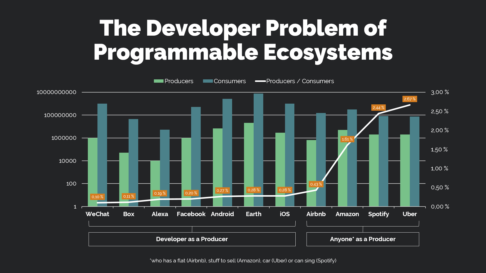
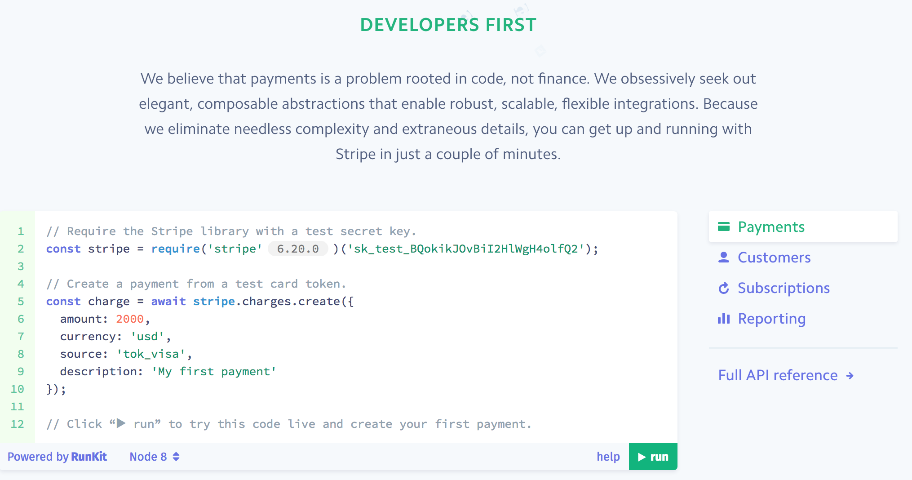

# APIs provide access to detailed data and function

Developers as they are traditionally understood are accustomed to use code – they actually breathe and eat code. Platform of Trust utilizes APIs extensively. Platform is built with microservice pattern (with common sense) and APIs fill our internal world. Platform capabilities are exposed with APIs as well. The first public APIs are REST style. Benefits and limitations of GraphQL API is under discussions and in the future we might have GraphQL APIs as well (not a promise). I'll discuss the specific APIs in future articles, but there will be plethora of APIs to manage marketplace, access data from various sources, handle user signup/login and profiles to mention a few.

# Specific easy to understand APIs

As it was mentioned in previous article (in Finnish), developer experience is one of fundamental elements of our platform. Since platform will expose capabilities with multiple REST APIs we need to put a lot of effort in building the best possible developer experience.

It is claimed that REST style APIs and microservice pattern has taken us to situation where APIs are compact packages and build for rather specific purpose. Thus APIs are pretty easy to understand (why they exist) and how to use them (good documentation is assumed). REST APIs are said to be so easy to consume that anything else is obsolete. I disagree with that when it comes to platforms.

# Problem solving requires multiple APIs

Yet to consume services and capabilities of any platform developer often needs to utilize multiple APIs. Developer needs to look at each of the APIs and build a logic in which order to use each and resolve the authentication. This is where libraries and ready-made components come into play. I know the title of this article might look odd and sound like marketing bullshit, but there's a solid idea behind it.

<blockquote>We can't afford to lose any of the developers Platform of Trust will attract. Instead the aim is to increase the share of developers in the ecosystem by any means available. </blockquote>

# Lower the barrier even more

Ease of use is a way to make sure that larger proportion of the developers can take advantage of your solution. The amount of developers in major application development platforms show that the cap is around 0,28% (white line in below pic. That amount of the platform "users" as developers are in iOS 0,28%, Facebook 0,20% and Android 0,27%.

(Image credits: Ville Ilkkala, Valaa Technologies)

For Platform of Trust aim is to raise the "white line" higher. The above graphics also show the difference between software development platforms and others for example Amazon (sell ready-made products), Spotify (content creation) and Über (offer taxi services). In these content oriented platforms skillset needed to participate (create something that can be sold) is completely different. I would argue that this problem is also one of the driving forces behind low-code and nocode platforms. The less "real" programming skills with legacy (current runtime environments) is needed, the more easily user can become prosumer (productive consumer). In busines life low-code and nocode tools are targeted at business developers and non-programmer users which need a simple app or automation to go on with plans without bothering IT department or ordering app from 3rd party.

But now we have come far from the original topic and focus of this article. I would suspect that low-code and nocode approach will be build on top of Platform of Trust eventually and should be discussed separately. Lets return to "legacy" world, where only "real" programmers can be productive. Let's have a look at what is "Low LOC" developer experience.

# Low LOC experience

Ready-made components for major development platforms do authentication, data structure conversion to runtime environment internals and many other things on behalf of the platform consumer. LOC stands for "lines of code". I chose to name this concept as "Low LOC" since it does not matter is the enabling artefact a component (for example for node.js), library or SDK. Just as long as the consuming developer can achieve results (eg solve a problem) with a few lines of code. In brief Low LOC developer experience is:

* developer consumes platform capabilities with around 5-10 lines of code.
* the above is offered for example by node.js component which can be installed with package management.
* Solution is often based on consuming exposed platform capabilities with help of APIs.

It seems that it makes sense to target “Low-LOC” (library) first. Of course APIs are built first, but for developers we offer productized libraries and components (mistakenly often called SDKs) for runtime environment and programming languages (node, python, java, php). Having great APIs enables library development not supported by the platform (community developed).

<blockquote>Low LOC support lowers the barrier to use your services and then even the "hobby" or "copy-paste" developers can become your customers.</blockquote> 

Examples of Low LOC experience can be found from the success stories of API Economy. Stripe is most likely the most wellknown developer-centric company. Ease of use eg developer experience is one of the main reasons of Stripe’s success. You can start to fiddle with their raw API with curl to learn how it works, but Stripe offers multiple libraries for production use. Official libraries for the Stripe API are in node, ruby, php, java, go and .NET. In addition there are some community-supported libraries for other programming languages and environments.

If you browse to Stripe's website, you'll soon discover the below invitation to test their services. **As you can see, Stripe does not push their APIs, but libraries.**

Twilio also has official npm packages (helper libraries) such as twilio-node and twilio-video.js. Twilio is not limited to JS only, but provides official python module too. 

<blockquote>Libraries or components which can be installed with package management such as npm and pip are programming or framework specific unlike REST APIs. </blockquote>

That is the strategy used by Pusher, Twilio, Stripe and many others. With pure API approach we at Platform of Trust will most likely not be able to offer simple enough and robust developer experience. Of course developer can use our raw APIs as well and occasionally that makes even more sense. To fulfill that need, detailed, easy to read and up-to-date Slate style 3-column API documentation is our top priority. Low LOC support has not been started yet in Platform of Trust, but the need for it has been noted.

# In brief

To maximise your service usage and largest possible developer community:

* Make sure your APIs hide the complexity, are easy to use and compact (not monsters includeing all possible in the world).
* Your API documentation is up-to-date, fluent to read and rich in content (real code examples)
* Offer libraries and components to hide the complexity even more for those seeking for slick and fast implementation.
