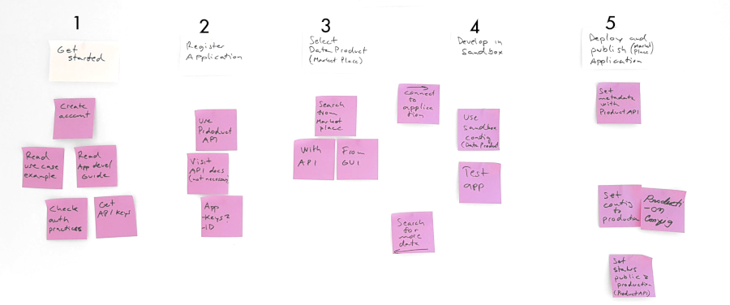

**Note: KOJAMO CASE APP, link to source code if possible**


# Publish Application with 5 steps



Some of the example code snippets (API invocations) use sandbox environment. 

# 1. Get started

You might want to read [use case description of one application](/use-cases/build-application). 

Information and understanding you need to have in the process: 
- API keys
- Get familiar with the authentication process. That is described in [Documentation](https://docs.oftrust.net/#authentication)


You will develop your application is sandbox environment. At the end you will change to production enviroment and publish your application to market place. 

# 2. Register Application 

You need to register your application to the Platform of Trust to gain access to App keys needed in API calls. Below is an example Product API invocation. 

```
curl "http://api.oftrust.net/products/" \
  -X POST \
  -H "X-PoT-Signature: xxx" \
  -H "X-PoT-Token: meowmeowmeow" \
  -H "X-PoT-App: xxx" 

  -d
    ...
    }}
```


# 3. Select Data Product to use

Next you probably want to use some data products in the Platform of Trust. You can search the market place for products with Product API. Here's an example how to make simple search and what is the response: 

```
curl "http://api.oftrust.net/products/" \
  -X GET \
  -H "X-PoT-Signature: xxx" \
  -H "X-PoT-Token: meowmeowmeow" \
  -H "X-PoT-App: xxx" 

```

We'll use the Data Product "kojamo" in the following steps and code examples. You should learn with this example how to find needed information about Data Products so you can do it again later again while looking for more data. 

Keep in mind that more detailed description of options can be found from the [Product API documentation](https://docs.oftrust.net). 

# 4. Develop and test in sandbox environment

Next you need to use selected Data Product in your application. Data is queried with Data Broker API. In the below example we get data from the above selected data product. Note that we use sandbox environment. You can see that from the URL. 

```

curl "http://sandbox-api.oftrust.net/data-broker/" \
  -X GET \
  -H "X-PoT-Signature: xxx" \
  -H "X-PoT-Token: meowmeowmeow" \
  -H "X-PoT-App: xxx" 

```


If you need more data, then go back to step 3 and search for additional data products from the market place. If you are done, proceeed to final step! 

# 5. Deploy and publish

Set the data product configuration in your application to ``production`` to use production environment data instead of sandbox data. 

Use Product API to define missing Application metadata. Required fields are: 
 - name
 - description
 - ....

 Publish your application with Product API by setting the ``publicity`` attribute to ``public``and ``status`` attribute to ``production``. Below is an example how to do that. Note that you need to change appID and....

 
```

curl "http://api.oftrust.net/product/translator" \
  -X PUT \
  -H "X-PoT-Signature: xxx" \
  -H "X-PoT-Token: meowmeowmeow" \
  -H "X-PoT-App: xxx" 

  -d
    ...
    }}
```


# Create account and get started!


If you are integrating data and creating data products, take a look at the [Data Product Guide](/developers/getstarted/data-products). 

Digital Twins is fundamental feature of the platform, take a look at the [Digital Twin Guide](/developers/getstarted/twins).

Open sandbox is your friend! Isolated environment for testing applications and data product integrations, read more from [Sandbox Guide](/developers/getstarted/sandbox).